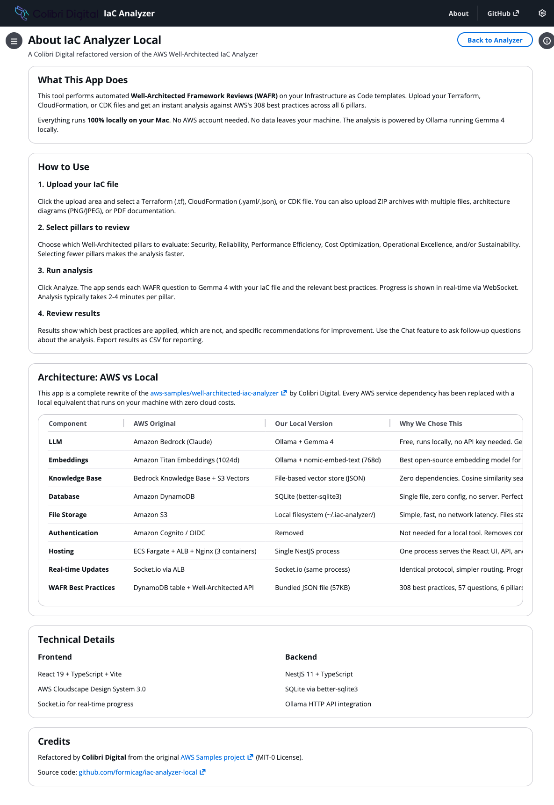

# IaC Analyzer Local - Installation Guide

**By Colibri Digital**

A step-by-step guide to install and run the Well-Architected IaC Analyzer on your Mac.

---

## Prerequisites

You need two things installed:

### 1. Node.js (v18 or newer)

Check if you have it:
```bash
node -v
```

If not installed, download from [nodejs.org](https://nodejs.org/) — use the LTS version.

### 2. Ollama

Check if you have it:
```bash
ollama --version
```

If not installed, download from [ollama.com/download](https://ollama.com/download). After installing, Ollama runs automatically in the background.

---

## Installation (5 minutes)

### Step 1: Clone the repository

```bash
git clone https://github.com/formicag/iac-analyzer-local.git
cd iac-analyzer-local
```

### Step 2: Pull the AI models

This downloads two models — Gemma 4 (9.6GB) for analysis and nomic-embed-text (274MB) for document search. This only needs to happen once.

```bash
ollama pull gemma4
ollama pull nomic-embed-text
```

> **Tip:** Gemma 4 is 9.6GB. On a slow connection, this may take 10-15 minutes. You can check progress in another terminal with `ollama list`.

### Step 3: Run the setup script

```bash
./setup.sh
```

This script:
- Installs Node.js dependencies
- Downloads AWS Well-Architected Framework whitepapers
- Embeds the whitepapers into a local knowledge base
- Builds the frontend and backend

> **First run only:** The knowledge base embedding takes a few minutes. Subsequent starts skip this step.

### Step 4: Start the app

```bash
npm start
```

The app will:
1. Find an available port automatically
2. Print the URL (e.g., `http://localhost:3000`)
3. Open your browser to that URL

---

## Using the App

### Upload your IaC file


1. Click **Choose files** and select your Terraform (.tf), CloudFormation (.yaml/.json), or CDK file
2. You can also upload ZIP archives, architecture diagrams (PNG/JPEG), or PDF documentation
3. All 6 Well-Architected pillars are selected by default — deselect any you don't need

### Start the review

Click **Start Review**. The app sends each Well-Architected question to the local Gemma 4 model with your IaC file and evaluates it against the relevant best practices.

Progress is shown in real-time. Each pillar takes roughly 2-4 minutes depending on your hardware.

### Review results

Results show a table of best practices with:
- **Applied** — the practice is implemented in your code
- **Not Applied** — the practice is missing, with specific recommendations
- **Not Relevant** — the practice can't be assessed from the provided file

### Chat and export

- Use the **Chat** button to ask follow-up questions about any finding
- Export results as **CSV** for reporting
- Get **detailed analysis** for any specific best practice

### About page



Click **About** in the top navigation to see:
- What the app does and how to use it
- Architecture comparison table (AWS version vs our local version)
- Technical details and credits

---

## Configuration (Optional)

Set environment variables before starting to customise behaviour:

| Variable | Default | Description |
|---|---|---|
| `OLLAMA_MODEL` | `gemma4` | LLM model for analysis |
| `OLLAMA_EMBED_MODEL` | `nomic-embed-text` | Embedding model for knowledge base |
| `OLLAMA_URL` | `http://localhost:11434` | Ollama server URL |
| `PORT` | `3000` | Starting port (auto-increments if busy) |
| `BATCH_SIZE` | `1` | Questions analyzed in parallel (keep at 1 for best results) |

Example:
```bash
OLLAMA_MODEL=gemma4 BATCH_SIZE=1 npm start
```

---

## Troubleshooting

### "Ollama is not running"

Start Ollama manually:
```bash
ollama serve
```

Or check it's installed: `ollama --version`

### "Model not found"

Pull the required models:
```bash
ollama pull gemma4
ollama pull nomic-embed-text
```

### Analysis seems slow

- Each question takes 1-3 minutes with Gemma 4 on a MacBook
- Selecting fewer pillars speeds things up significantly
- Security pillar alone: ~30 minutes for 11 questions
- All 6 pillars: ~2-3 hours for 57 questions

### Port already in use

The app automatically finds an available port. If you need a specific port:
```bash
PORT=8080 npm start
```

---

## Data & Privacy

All data stays on your machine:

```
~/.iac-analyzer/
├── data.db        # Analysis results and work items
├── uploads/       # Your uploaded files
├── chromadb/      # Knowledge base embeddings
└── wafr-docs/     # Downloaded AWS whitepapers
```

To completely remove all data:
```bash
rm -rf ~/.iac-analyzer
```

---

## Updating

```bash
cd iac-analyzer-local
git pull
./setup.sh
npm start
```
