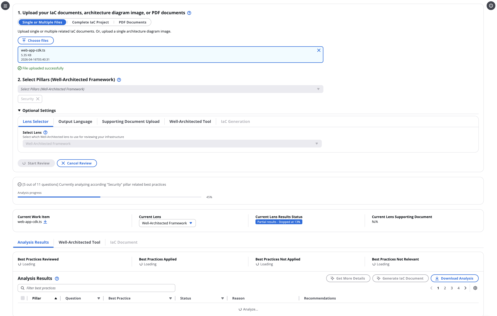
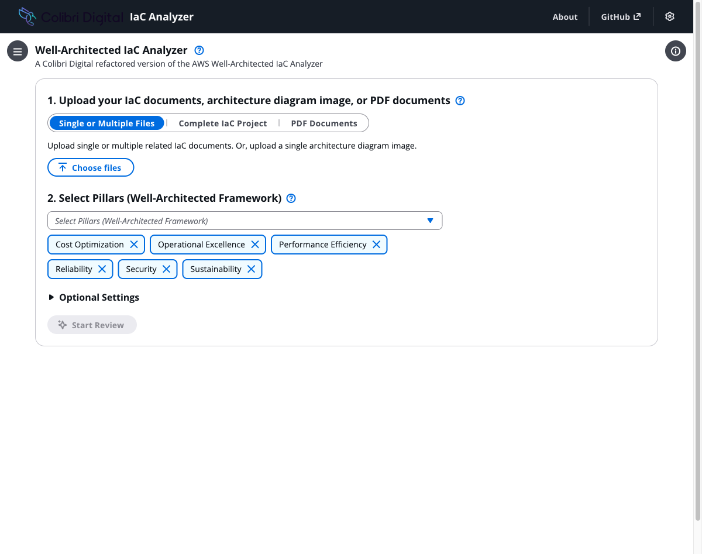

# Free Local Well-Architected Framework Review Tool

Hi team,

I wanted to share a tool I've put together that gives us free, unlimited Well-Architected Framework Reviews (WAFR) — running entirely on your laptop with no AWS costs.

## What is it?

AWS published an open-source project called the **[Well-Architected IaC Analyzer](https://github.com/aws-samples/well-architected-iac-analyzer)** (MIT-0 license, free to use and modify, actively maintained — 265 commits in 2025, last updated 10 April 2026). It takes your Terraform, CloudFormation, or CDK templates and automatically reviews them against the full AWS Well-Architected Framework — all 308 best practices across the 6 pillars (Security, Reliability, Performance Efficiency, Cost Optimization, Operational Excellence, Sustainability).

Here's the original AWS version running a Security pillar review on a CDK file:



The AWS version runs on Bedrock (Claude), ECS Fargate, DynamoDB, S3, Cognito, and a Bedrock Knowledge Base. It's a great tool, but it costs roughly **$80/day** to run in AWS, and requires Bedrock model access which isn't available on our partner account.

And here's our local Colibri Digital version — same functionality, zero AWS costs:



## What I did

In a single evening, using Claude Code, I took the AWS open-source project and **replaced every cloud component with a free local equivalent**:

| Component | AWS Original | Our Local Version | Why |
|---|---|---|---|
| **LLM** | Amazon Bedrock (Claude Sonnet) | Ollama + Gemma 4 | Free, runs locally, no API keys |
| **Embeddings** | Amazon Titan (1024d) | nomic-embed-text (768d) | Best open-source embedding model |
| **Knowledge Base** | Bedrock KB + S3 Vectors | File-based vector store | Zero dependencies, cosine similarity search |
| **Database** | Amazon DynamoDB | SQLite | Single file, zero config |
| **File Storage** | Amazon S3 | Local filesystem | Files stay on your machine |
| **Auth** | Amazon Cognito / OIDC | Removed | Not needed for a local tool |
| **Hosting** | ECS Fargate + ALB + Nginx (3 containers) | Single Node.js process | One command to start |

The result is a complete, working WAFR review tool that runs on your Mac (also works on Linux/Ubuntu — requires bash and Node.js). **No AWS account, no API keys, no costs.**

## How it works (technically)

1. **You upload** a Terraform/CloudFormation/CDK file
2. The app loads the **308 WAFR best practices** (bundled as a 57KB JSON file covering 57 questions across 6 pillars)
3. For each question, the app queries the **local knowledge base** (embedded WAFR whitepapers — 7 AWS PDF documents chunked and stored as vector embeddings) to retrieve relevant context via semantic search
4. The **LLM (Gemma 4)** receives the system prompt, your IaC file, the relevant best practices, and the RAG context — then analyses whether each best practice is applied, not applied, or not relevant
5. Results are returned as structured JSON and displayed in the Cloudscape UI with recommendations
6. You can **chat** with the results, get **detailed analysis**, or **export as CSV**

This repeats for each of the 57 questions across whichever pillars you select. A full 6-pillar review takes about 2 hours locally (vs minutes on Bedrock) — but it's free and you can start it and come back later.

## How does it compare to MontyCloud?

We purchased MontyCloud for WAFR reviews. MontyCloud is a polished commercial product with many more features, a friendlier UI, and is designed for production use. This tool is not a replacement for MontyCloud.

**However**, MontyCloud access is limited to a small team, and every review costs money. This local tool can be used by a much wider team — anyone with a Mac can install it and run unlimited reviews at zero cost. It's ideal for:

- Engineers who want to **check their IaC before submitting PRs**
- Teams without MontyCloud access who want **early WAFR feedback**
- Training and learning about Well-Architected best practices
- Running reviews on draft architectures before they're production-ready

## Quality of results

I tested the local version with Gemma 4 against several Terraform files with intentional issues (both obvious and subtle). The results are **very strong** — Gemma 4 correctly identified:

- Hardcoded passwords, publicly accessible databases, missing encryption
- Single-AZ deployments, fixed ASG capacity (can't scale), no Multi-AZ
- Missing CloudWatch alarms, no ALB access logs, no deployment strategies
- Over-provisioned instances, no S3 lifecycle rules, no auto-scaling
- Missing VPC flow logs, no WAF, no IMDSv2 enforcement

All 12 specific issues I planted were caught. The recommendations are detailed and actionable, with specific Terraform modifications suggested.

I also deployed the full AWS version to compare results side by side:

| | **AWS (Claude Sonnet 4.6)** | **Local (Gemma 4)** |
|---|---|---|
| Speed (Security pillar) | ~10 minutes | ~33 minutes |
| Best practices reviewed | 63 | 63 |
| Applied | 5 | 2 |
| Not Applied | 44 | 36 |
| **Agreement rate** | — | **93%** |
| Cost per analysis | ~$0.30 | $0 |

93% of assessments were identical. The 4 disagreements were judgment calls where Gemma 4 was stricter (flagging partial implementations that Claude accepted). For a review tool, stricter is arguably better.

See the full comparison report in `docs/COMPARISON_REPORT.md`.

## Platform compatibility

- **Mac**: Fully supported (tested)
- **Linux / Ubuntu**: Should work — uses bash, Node.js, and Ollama (all available on Linux)
- **Windows**: Not directly supported (setup.sh is bash). Could work via WSL2

## Source & maintenance

- **Our repo**: https://github.com/formicag/iac-analyzer-local
- **Original AWS repo**: https://github.com/aws-samples/well-architected-iac-analyzer (MIT-0 license, actively maintained — 265 commits in 2025, last updated 10 April 2026)
- **Installation guide**: See `docs/INSTALLATION_GUIDE.md` in the repo

## Installation (5 minutes)

```bash
# Install Ollama from https://ollama.com/download
ollama pull gemma4 && ollama pull nomic-embed-text
git clone https://github.com/formicag/iac-analyzer-local.git
cd iac-analyzer-local && ./setup.sh
npm start
```

The app opens in your browser. Upload a .tf file, select your pillars, click Start Review.

## The bigger picture

What I'm trying to demonstrate here is that with tools like Claude Code, we can take open-source projects and rapidly adapt them for local use. In one evening session, I:

- Analysed the full architecture of a complex AWS application
- Replaced 8 AWS service dependencies with local equivalents
- Ported the React frontend (Cloudscape Design System)
- Optimised the LLM prompts for a local model (Gemma 4)
- Built a setup script for one-command installation
- Added security hardening (file validation, CORS, input sanitisation)
- Created test fixtures and validated results across all 6 WAFR pillars
- Wrote documentation and an installation guide
- Deployed to GitHub

The trade-off is speed (2 hours vs minutes for a full review), but it's free, private, and available to everyone. For a tool that's meant to be kicked off and checked later, that's a reasonable trade-off.

## Why we can't run the AWS version on our work account

The original AWS IaC Analyzer uses Claude (Anthropic) on Amazon Bedrock. I tested deploying it to our Colibri Digital AWS partner account, but Anthropic models are **not available on AWS Channel Partner accounts**. When attempting to invoke any Claude model, Bedrock returns:

> *"Access to this model is not available for channel program accounts. Reach out to your AWS Solution Provider or AWS Distributor for more information."*

This is a licensing restriction — AWS Channel Partner Program accounts (like ours) don't have access to third-party foundation models (Anthropic, Cohere, Meta, etc.) through the standard Bedrock on-demand pricing. Access requires either a separate agreement with the model provider or using a non-partner AWS account.

I tested the full AWS deployment on a personal AWS account where Claude is available, and confirmed the results are comparable to our local Gemma 4 version. The local version avoids this licensing issue entirely since Gemma 4 is open-source and runs on your own hardware.

## Prerequisites comparison

| | **Local version (ours)** | **AWS version (original)** |
|---|---|---|
| **Node.js** | Required | Required |
| **Ollama** | Required | Not needed |
| **Docker** | **Not required** | Required (for CDK deployment) |
| **AWS Account** | Not needed | Required (with Bedrock access) |
| **Bedrock model access** | Not needed | Required (Claude — not available on partner accounts) |
| **Running cost** | Free | ~$10-15/day (S3 Vectors) or ~$80/day (OpenSearch) |

## Platform compatibility

- **Mac**: Fully tested and supported
- **Linux / Ubuntu**: Works — uses bash, Node.js, and Ollama (all available on Linux)
- **Windows**: Not directly supported (setup.sh is bash). Would work via WSL2 (Windows Subsystem for Linux)

Happy to walk anyone through the setup or answer questions.

Cheers,
Gianluca
